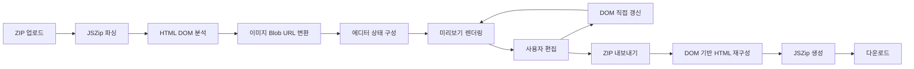
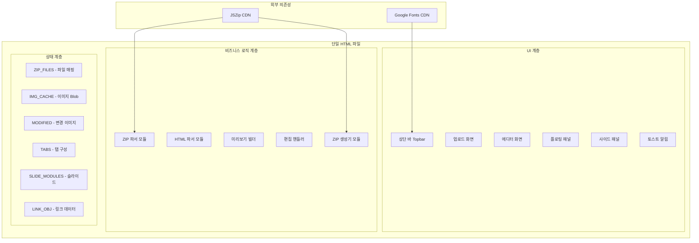
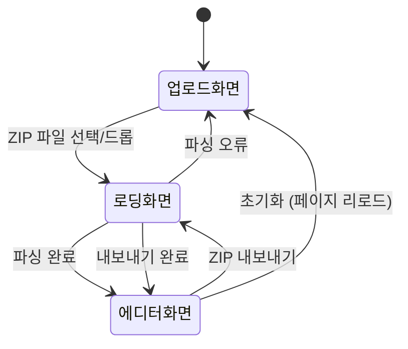

# 설계 문서: HTML 콘텐츠 에디터

> **구현 파일:** `AI_CCC.html` (프로젝트 루트)
> 원래 `Editor/editor.html`로 계획되었으나, 최종 구현 시 루트 레벨의 `AI_CCC.html` 단일 파일로 변경되었다.

## 개요

롯데백화점 내부 직원이 APP/홈페이지용 HTML 콘텐츠를 브라우저에서 직접 편집할 수 있는 단일 HTML 파일 기반 WYSIWYG 에디터이다. 서버 없이 브라우저에서 HTML 파일을 열어 바로 사용하며, JSZip CDN을 통해 ZIP 파일을 파싱·편집·내보내기한다.

### 핵심 설계 결정

| 결정 사항 | 선택 | 근거 |
|-----------|------|------|
| 배포 형태 | 단일 HTML 파일 | 서버 설치 없이 브라우저에서 바로 실행. 비개발 직원도 파일 더블클릭으로 사용 가능 |
| ZIP 처리 | JSZip 3.10.1 (CDN) | 클라이언트 측 ZIP 파싱/생성 지원. CDN으로 별도 번들링 불필요 |
| 상태 관리 | 전역 JavaScript 객체 | 프레임워크 없이 단일 파일 내에서 관리. 복잡도 대비 단순성 우선 |
| UI 프레임워크 | Vanilla JS + CSS | 외부 의존성 최소화. 단일 파일 제약 충족 |
| 폰트 | Noto Sans KR (Google Fonts CDN) | 한국어 UI 최적화 |

### 주요 흐름



> **구현 변경 — DOM 기반 내보내기:** 원래 설계에서는 rawContent 문자열을 기반으로 HTML을 재구성하는 방식이었으나, 실제 구현에서는 `buildOutput()` 함수가 에디터 DOM(`#phone`)의 현재 상태를 직접 읽어서 내보내기용 HTML을 생성한다. 이 방식은 추가/삭제/순서변경이 자동으로 반영되는 장점이 있다.

## 아키텍처

### 전체 구조

단일 HTML 파일 내에 CSS, HTML 마크업, JavaScript를 모두 포함하는 모놀리식 구조이다. 논리적으로는 다음 계층으로 분리된다.



### 화면 전환 흐름



## 컴포넌트 및 인터페이스

### 1. ZIP 파서 모듈 (`processZip`)

ZIP 파일을 읽어 내부 파일 구조를 메모리에 로드한다.

**입력:** `File` 객체 (ZIP 파일)
**출력:** 전역 상태 객체 갱신 (`ZIP_FILES`, `IMG_CACHE`)

**처리 흐름:**
1. `FileReader`로 `ArrayBuffer` 변환
2. `JSZip.loadAsync()`로 ZIP 엔트리 목록 추출
3. 중첩 폴더 감지: `index.html` 경로에서 prefix 추출 (예: `html_999999sn/`)
4. 각 엔트리를 유형별 처리:
   - 이미지 파일 (`.jpg`, `.png`, `.gif`, `.webp`, `.svg`): `ArrayBuffer` → `Blob` → `URL.createObjectURL()` → `IMG_CACHE`에 저장
   - 텍스트 파일 (`.html`, `.css`, `.js`, `.json`): 문자열로 `ZIP_FILES`에 저장
   - 기타 바이너리: `Uint8Array`로 `ZIP_FILES`에 저장
5. `index.html` 내용을 `HTML_SRC`에 저장
6. `parseHTML()` 호출 → `buildEditor()` 호출

**인터페이스:**
```javascript
async function processZip(file: File): void
// 전역 상태 초기화 후 ZIP 파싱 → parseHTML → buildEditor 순차 호출
```

### 2. HTML 파서 모듈 (`parseHTML`)

`index.html` 문자열에서 콘텐츠 구조를 추출한다.

**처리 대상:**
- `contentName`, `contentCode`: `<head>` 내 스크립트에서 정규식 추출
- `linkObj`: 스크립트 내 배열 리터럴 파싱
- 탭 구조: `tab-btn-area`, `tab-btn`, `tab-area` 클래스 기반 DOM 패턴 매칭
- 슬라이드: `swiper-mask` 내부 `swiper-slide` 이미지 경로 추출
- 외부 이미지: `http://` 또는 `https://`로 시작하는 `` 수집

**인터페이스:**
```javascript
function parseHTML(): void
// HTML_SRC를 분석하여 TABS, SLIDE_MODULES, LINK_OBJ, EXT_IMAGES 갱신
```

### 3. 미리보기 빌더 (`buildEditor`)

파싱된 상태를 기반으로 에디터 미리보기 DOM을 생성한다.

**구조 분기:**
- **탭 있는 구조**: `tab-btn-area` → 탭 버튼 렌더링 → 각 `tab-area` 내부 콘텐츠 렌더링
- **탭 없는 구조**: `eventBox` 내부 `img-box` 또는 직접 이미지/슬라이드 순차 렌더링

**소스 영역 유형별 렌더링:**
| 유형 | CSS 클래스 | 호버 색상 | 클릭 동작 |
|------|-----------|----------|----------|
| 이미지 블록 | `ez-img` | 보라색 (`--acc2`) | 이미지 교체 플로팅 패널 |
| 링크 블록 | `ez-link` | 분홍색 (`--acc`) | 링크 편집 플로팅 패널 |
| 슬라이드 블록 (원본) | `ez-slide-item` | 녹색 (`--grn`) | 슬라이드 관리 사이드 패널 |
| 슬라이드 블록 (추가) | `ez-slide-item` + `data-block-slide="true"` | 녹색 (`--grn`) | 슬라이드 관리 사이드 패널 |
| 탭 버튼 | `tab-btn` | 노란색 (`--yel`) | 탭 전환 / 더블클릭: 탭 관리 |
| 텍스트 | `et` | 노란색 (`--yel`) | 인라인 텍스트 편집 |

> **구현 변경 — 두 가지 슬라이드 유형:**
> - **원본 슬라이드** (ZIP에서 가져온 것, `isOriginal: true`): swiper 뷰포트로 렌더링되어 좌우 네비게이션 + 도트 인디케이터로 탐색. 내보내기 시 `swiper-mask` 구조로 출력.
> - **에디터 추가 슬라이드** (사용자가 삽입한 것, `isOriginal: false`): 블록형(block-type)으로 렌더링되어 이미지가 세로로 쌓임. 내보내기 시 개별 `` 태그로 출력 (swiper-mask 아님).

> **구현 변경 — 삽입 존(Insert Zone):**
> 원래 설계에서는 모든 소스 영역 사이에 삽입 버튼을 배치하려 했으나, 실제 구현에서는 각 콘텐츠 영역의 하단에만 1개의 삽입 존을 배치한다.

> **구현 변경 — 빈 탭 기본 콘텐츠:**
> 새로 추가된 빈 탭에는 플레이스홀더 이미지 블록이 기본으로 표시된다.

> **구현 변경 — 탭 관리 패널 동작:**
> 탭 관리 패널에서 이미지를 업로드해도 패널이 닫히지 않고 열린 상태를 유지한다. 패널은 X 버튼으로만 닫을 수 있다.

> **구현 변경 — Swiper CSS 오버라이드:**
> 에디터 내에서 원본 CSS의 `position:absolute` 등이 미리보기를 깨뜨리는 것을 방지하기 위해, `#phone .swiper-mask` 등에 `position:static !important`를 강제 적용한다.

**인터페이스:**
```javascript
function buildEditor(): void
// 전역 상태 기반으로 #phone 내부 DOM 생성
function buildTabAreaContent(tabIdx): string
// 탭 내부 콘텐츠 HTML 문자열 생성 (탭 인덱스 기반)
function buildAreaContent(isNoTab): string
// 탭 없는 구조의 콘텐츠 HTML 문자열 생성
function buildSlideViewport(slides, tabIdx, moduleIdx): string
// 슬라이드 뷰포트 HTML 생성 — isOriginal 여부에 따라 swiper 뷰포트 또는 블록형 렌더링
```

### 4. 편집 핸들러

각 소스 영역 유형별 편집 기능을 처리한다.

#### 4.1 이미지 편집 (`openImgFp`)
- 플로팅 패널 표시: 이미지 업로드 영역 + alt 텍스트 입력
- 이미지 선택 시 `FileReader`로 `dataURL` 변환 → `MODIFIED[path]`에 저장
- 미리보기 즉시 갱신: `` 태그의 `src` 속성 교체

#### 4.2 링크 편집 (`openLinkFp`)
- 플로팅 패널 표시: 링크 유형 선택 + URL 입력 + 버튼명 입력 + 이미지 교체
- `LINK_OBJ[index]`의 `type`, `url`, `value` 갱신

#### 4.3 슬라이드 편집 (`openSp` / `openSpM`)
- 사이드 패널 표시: 슬라이드 목록 + 추가/삭제/교체 기능
- `SLIDES[]` 또는 `SLIDE_MODULES[tabIdx][moduleIdx]` 갱신
- 슬라이드 뷰포트 내 좌우 네비게이션 + 도트 인디케이터

#### 4.4 탭 관리 (`openTabMgr`)
- 탭 관리 패널 표시: 각 탭의 on/off 이미지 업로드 + 탭 삭제
- `TABS[]` 배열 갱신
- 탭 추가/삭제 시 `buildEditor()` 재호출로 전체 미리보기 갱신

#### 4.5 텍스트 편집
- `contenteditable` 활성화 → 텍스트 툴바 표시 (확인/취소)
- `TEXT_MODS[uid]`에 변경 텍스트 저장

### 5. ZIP 생성기 모듈 (`exportZip`)

편집된 상태를 ZIP 파일로 재조립한다.

**처리 흐름:**
1. `buildOutput()`으로 편집된 `index.html` 문자열 생성 — **DOM 기반 접근**: 에디터 DOM(`#phone`)의 현재 상태를 직접 읽어서 원본 HTML 구조로 변환. rawContent 문자열 대신 라이브 DOM을 소스로 사용하여 추가/삭제/순서변경이 자동 반영됨
2. `ZIP_FILES`의 원본 파일들을 ZIP에 추가 (css/, js/ 등 변경 없이)
3. `MODIFIED`의 교체 이미지를 `dataURL` → `Uint8Array` 변환 후 원본 경로에 덮어쓰기
4. `SLIDES` / `SLIDE_MODULES`의 새 슬라이드 이미지 추가
5. `TABS`의 새 탭 버튼 이미지 추가 (`images/tab/tabN_on.jpg`, `images/tab/tabN_off.jpg`)
6. `JSZip.generateAsync({type:'blob'})` → `<a>` 태그 다운로드

> **구현 변경 — 슬라이드 내보내기 분기:**
> - 원본 슬라이드 (`isOriginal: true`, `data-block-slide="false"`): `swiper-mask > swiper > swiper-wrapper > swiper-slide` 구조로 내보내기
> - 에디터 추가 슬라이드 (`isOriginal: false`, `data-block-slide="true"`): 개별 `` 태그로 내보내기 (swiper 구조 없음)

**인터페이스:**
```javascript
async function exportZip(): void
// 전역 상태 → ZIP Blob → 브라우저 다운로드
function buildOutput(): string
// 에디터 DOM(#phone)의 현재 상태를 읽어 편집된 index.html 문자열 재구성
// rawContent 대신 DOM을 소스로 사용하여 추가/삭제/순서변경이 자동 반영
```

### 6. UI 컴포넌트

#### 6.1 상단 바 (Topbar)
- 브랜드 로고, 파일명 힌트, 범례, 디바이스 토글 (MO/PC), 변경됨 배지
- 콘텐츠 정보 버튼, 초기화 버튼, ZIP 저장 버튼

#### 6.2 업로드 화면
- 드래그 앤 드롭 영역 + 파일 선택 버튼
- ZIP 구조 안내 트리 + 사용 단계 안내

#### 6.3 플로팅 패널 (Floating Panel)
- 이미지/링크 편집 시 클릭 위치 근처에 표시
- 이미지 업로드 영역, 입력 필드, 확인/취소 버튼

#### 6.4 사이드 패널 (Slide Panel)
- 슬라이드 관리 시 우측에서 슬라이드 인
- 슬라이드 목록, 추가/삭제 버튼, 이미지 업로드

#### 6.5 콘텐츠 정보 드로어 (Info Drawer)
- 하단에서 올라오는 패널
- contentName, contentCode 입력 필드

#### 6.6 토스트 알림
- 성공(녹색), 오류(빨간색), 정보(보라색), 경고(노란색)
- 2초 후 자동 사라짐

## 데이터 모델

### 전역 상태 객체

```mermaid
erDiagram
    ZIP_FILES {
        string path PK "상대 경로 (예: images/tab1/img_01.jpg)"
        binary data "string(텍스트) 또는 Uint8Array(바이너리)"
    }
    IMG_CACHE {
        string path PK "이미지 상대 경로"
        string blobUrl "URL.createObjectURL() 결과"
    }
    MODIFIED {
        string path PK "변경된 파일 경로 또는 __ext__URL"
        string dataUrl "base64 dataURL"
    }
    TEXT_MODS {
        string uid PK "고유 텍스트 요소 ID"
        string text "변경된 텍스트 내용"
    }
    TABS {
        int index PK "탭 인덱스"
        string name "탭 이름 (data-tab-name)"
        object offImg "off 이미지 {src, dataUrl, name}"
        object onImg "on 이미지 {src, dataUrl, name}"
        string rawContent "원본 tab-area 내부 HTML"
    }
    SLIDE_MODULES {
        int tabIdx PK "탭 인덱스"
        int moduleIdx PK "모듈 인덱스"
        int posIdx "삽입 위치"
        boolean isOriginal "원본 여부"
        array slides "슬라이드 배열 [{src, dataUrl, name}]"
    }
    LINK_OBJ {
        int index PK "링크 인덱스"
        string type "링크 유형 (event, BrowserOpen, shopping 등)"
        string url "링크 URL"
        string value "버튼명"
    }
    EXT_IMAGES {
        string src PK "외부 이미지 URL"
        string dataUrl "교체 시 base64 dataURL"
        string name "교체 파일명"
    }
```



### 상태 변수 상세

```javascript
// ── 파일 저장소 ──
let ZIP_FILES = {};    // { 'index.html': '...', 'css/style.css': '...', 'images/top.jpg': Uint8Array }
let IMG_CACHE = {};    // { 'images/top.jpg': 'blob:...' }
let MODIFIED = {};     // { 'images/top.jpg': 'data:image/jpeg;base64,...' }
let TEXT_MODS = {};    // { 'u1': '변경된 텍스트' }

// ── 탭 구성 ──
let TABS = [];         // [ { name, offImg:{src,dataUrl,name}, onImg:{src,dataUrl,name}, rawContent } ]
let activeTabIdx = 0;  // 현재 활성 탭 인덱스

// ── 슬라이드 ──
let SLIDES = [];       // 탭 없는 구조: [ {src, dataUrl, name, isExt} ]
let SLIDE_MODULES = {};// 탭 있는 구조: { 0: [{posIdx, isOriginal, slides:[...]}], 1: [...] }

// ── 링크 ──
let LINK_OBJ = [];     // [ {type, url, value} ]

// ── 외부 이미지 ──
let EXT_IMAGES = [];   // [ {src, dataUrl, name} ]

// ── HTML 원본 ──
let HTML_SRC = '';     // index.html 원본 문자열 (초기화 시 복원용)
```

### 이미지 경로 해석 함수 (`rImg`)

이미지 표시 시 우선순위:
1. `MODIFIED[path]` — 사용자가 교체한 이미지 (dataURL)
2. `IMG_CACHE[path]` — ZIP에서 추출한 원본 이미지 (Blob URL)
3. 원본 경로 — 외부 URL 이미지 등 fallback

### ZIP 디렉터리 구조 매핑

```
project.zip
├── index.html                    → ZIP_FILES['index.html'] (string)
├── css/
│   ├── style.css                 → ZIP_FILES['css/style.css'] (string)
│   ├── swiper.min.css            → ZIP_FILES['css/swiper.min.css'] (string)
│   └── ...
├── js/
│   ├── common.js                 → ZIP_FILES['js/common.js'] (string)
│   ├── tab.js                    → ZIP_FILES['js/tab.js'] (string)
│   └── ...
└── images/
    ├── top_img.jpg               → ZIP_FILES + IMG_CACHE (Blob URL)
    ├── tab/
    │   ├── tab1_on.jpg           → TABS[0].onImg.src
    │   ├── tab1_off.jpg          → TABS[0].offImg.src
    │   └── ...
    ├── tab1/
    │   ├── img_01.jpg            → 탭1 이미지 블록
    │   └── slide/1/1.png         → SLIDE_MODULES[0][n].slides[0]
    └── tab2/
        ├── img_01.jpg            → 탭2 이미지 블록
        └── slide/1/1.png         → SLIDE_MODULES[1][n].slides[0]
```

### 중첩 폴더 처리

ZIP 내에 `html_999999sn/index.html`처럼 중첩 폴더가 있는 경우:
1. `index.html` 경로에서 prefix 추출: `html_999999sn/`
2. 모든 파일 경로에서 prefix 제거: `html_999999sn/images/top.jpg` → `images/top.jpg`
3. 내보내기 시에는 prefix 없이 루트 기준으로 ZIP 생성

## 정확성 속성 (Correctness Properties)

*정확성 속성(Property)이란 시스템의 모든 유효한 실행에서 참이어야 하는 특성 또는 동작을 의미한다. 사람이 읽을 수 있는 명세와 기계가 검증할 수 있는 정확성 보장 사이의 다리 역할을 한다.*

### Property 1: ZIP 파싱-내보내기 라운드트립

*For any* 유효한 ZIP 파일(index.html + images/ + css/ + js/ 포함)을 파싱한 후 아무 편집 없이 내보내기하면, 출력 ZIP의 디렉터리 구조는 원본과 동일해야 하고, css/ 및 js/ 파일의 내용은 원본과 바이트 단위로 동일해야 한다.

**Validates: Requirements 11.1, 11.2, 11.5, 11.6**

### Property 2: ZIP 파싱 완전성

*For any* ZIP 파일 내의 파일 엔트리에 대해, 이미지 파일(jpg, png, gif, webp, svg)은 `IMG_CACHE`에 유효한 Blob URL로 저장되어야 하고, 텍스트 파일(html, css, js, json)은 `ZIP_FILES`에 문자열로 저장되어야 하며, 기타 바이너리 파일은 `ZIP_FILES`에 `Uint8Array`로 저장되어야 한다.

**Validates: Requirements 1.1, 1.3**

### Property 3: 중첩 폴더 경로 정규화

*For any* ZIP 파일에서 `index.html`이 중첩 폴더(예: `prefix/index.html`) 내에 존재하는 경우, 파싱 후 `ZIP_FILES`와 `IMG_CACHE`의 모든 키는 prefix가 제거된 상대 경로여야 한다.

**Validates: Requirements 1.7**

### Property 4: HTML 파싱 소스 영역 순서 보존

*For any* eventBox 내부에 이미지 블록, 링크 블록, 슬라이드 블록이 포함된 유효한 HTML에 대해, `parseHTML()` 후 `buildEditor()`가 생성하는 미리보기의 소스 영역 순서는 원본 HTML의 DOM 순서와 동일해야 한다. 탭이 2~5개인 구조에서도 모든 탭이 정상적으로 인식되어야 한다.

**Validates: Requirements 1.2, 2.1, 15.3**

### Property 5: 이미지 교체 경로 보존

*For any* 이미지 경로와 새 이미지 데이터에 대해, 이미지를 교체하면 `MODIFIED` 맵에 원본 경로를 키로 새 dataURL이 저장되어야 하고, `rImg(원본경로)`는 새 dataURL을 반환해야 한다.

**Validates: Requirements 3.2, 3.3**

### Property 6: 링크 객체 필드 갱신

*For any* 유효한 링크 인덱스와 새 값(type, url, value)에 대해, 해당 필드를 변경하면 `LINK_OBJ[index]`의 해당 필드만 갱신되고 나머지 필드는 변경되지 않아야 한다.

**Validates: Requirements 4.2, 4.3, 4.4**

### Property 7: 슬라이드 개수 불변식

*For any* 슬라이드 모듈에 대해: (a) 슬라이드를 추가하면 개수가 정확히 1 증가하고 새 슬라이드가 목록 끝에 위치해야 하며, (b) 슬라이드가 2개 이상일 때 삭제하면 개수가 정확히 1 감소해야 하고, (c) 슬라이드가 1개만 남은 상태에서는 삭제가 차단되어야 한다.

**Validates: Requirements 5.2, 5.3, 5.5**

### Property 8: 소스 영역 순서 변경 일관성

*For any* 소스 영역 목록의 순열(permutation)에 대해, 순서를 변경한 후 렌더링된 미리보기의 소스 영역 순서는 변경된 데이터 모델의 순서와 정확히 일치해야 한다.

**Validates: Requirements 8.2, 8.3**

### Property 9: 탭 개수 불변식 및 너비 계산

*For any* 탭 구성에 대해: (a) 탭을 추가하면 `TABS` 배열 길이가 정확히 1 증가해야 하고, (b) 탭이 2개 이상일 때 삭제하면 길이가 정확히 1 감소하고 해당 탭의 콘텐츠 영역도 함께 제거되어야 하며, (c) 탭이 1개만 남은 상태에서는 삭제가 차단되어야 하고, (d) N개의 탭이 있을 때 각 탭 버튼의 너비는 100/N 퍼센트여야 한다.

**Validates: Requirements 9.1, 9.2, 9.3, 9.5**

### Property 10: 텍스트 편집 취소 복원

*For any* 텍스트 요소에 대해, 인라인 편집 모드에서 텍스트를 변경한 후 취소하면 텍스트가 편집 전 원본 값으로 정확히 복원되어야 한다.

**Validates: Requirements 12.3**

## 오류 처리

### 오류 유형 및 처리 전략

| 오류 상황 | 처리 방식 | 사용자 피드백 |
|-----------|----------|-------------|
| ZIP 형식이 아닌 파일 업로드 | `JSZip.loadAsync()` 예외 캐치 | 빨간색 토스트: "ZIP 파일만 지원됩니다" |
| index.html 없는 ZIP | 엔트리 검색 실패 | 빨간색 토스트: "index.html 파일이 포함되어야 합니다" |
| 손상된 ZIP 파일 | JSZip 파싱 예외 | 빨간색 토스트: "ZIP 파일이 손상되었거나 올바른 형식이 아닙니다" |
| HTML 파싱 오류 | try-catch로 감싸고 콘솔 로그 | 빨간색 토스트: "에디터 구성 오류" |
| 이미지 파일 읽기 실패 | FileReader 오류 핸들링 | 빨간색 토스트: "이미지 파일을 읽을 수 없습니다" |
| ZIP 생성 실패 | JSZip 생성 예외 | 빨간색 토스트: "ZIP 생성 실패" |
| 최소 슬라이드 삭제 시도 | 삭제 차단 | 빨간색 토스트: "최소 1개의 슬라이드가 필요합니다" |
| 최소 소스 영역 삭제 시도 | 삭제 차단 | 빨간색 토스트: "최소 1개의 콘텐츠 영역이 필요합니다" |
| 최소 탭 삭제 시도 | 삭제 차단 | 빨간색 토스트: "최소 1개의 탭이 필요합니다" |
| CDN 로드 실패 (JSZip) | 스크립트 로드 실패 시 기능 비활성화 | 업로드 화면에 오류 안내 |

### 토스트 알림 시스템

```javascript
function showToast(message, type) {
  // type: 's'(성공/녹색), 'e'(오류/빨간색), 'i'(정보/보라색), 'w'(경고/노란색)
  // 2초 후 자동 사라짐
}
```

### 방어적 프로그래밍

- 모든 DOM 조작은 `try-catch`로 감싸서 부분 실패가 전체 에디터를 중단시키지 않도록 한다
- `parseHTML()`은 정규식 기반이므로 예상치 못한 HTML 구조에서도 graceful하게 빈 결과를 반환한다
- 이미지 경로 해석 함수 `rImg()`는 fallback 체인을 통해 항상 유효한 값을 반환한다

## 테스팅 전략

### 이중 테스팅 접근법

이 프로젝트는 **단위 테스트**와 **속성 기반 테스트(Property-Based Testing)**를 병행한다.

### 속성 기반 테스트 (PBT)

**라이브러리:** [fast-check](https://github.com/dubzzz/fast-check) (JavaScript PBT 라이브러리)

**적용 대상:** 순수 로직 함수 (ZIP 파싱, HTML 파싱, 경로 정규화, 데이터 모델 조작)

**설정:**
- 각 속성 테스트는 최소 100회 반복 실행
- 각 테스트에 설계 문서의 속성 번호를 태그로 포함
- 태그 형식: `Feature: html-content-editor, Property {번호}: {속성 설명}`

**PBT 대상 속성:**
| 속성 | 패턴 | 테스트 전략 |
|------|------|-----------|
| Property 1: ZIP 라운드트립 | Round-trip | 랜덤 ZIP 구조 생성 → 파싱 → 내보내기 → 구조 비교 |
| Property 2: ZIP 파싱 완전성 | Invariant | 랜덤 파일 엔트리 → 유형별 저장소 확인 |
| Property 3: 경로 정규화 | Invariant | 랜덤 prefix + 파일 경로 → prefix 제거 확인 |
| Property 4: 소스 영역 순서 | Invariant | 랜덤 HTML 구조 → 파싱 순서 확인 |
| Property 5: 이미지 교체 경로 | Invariant | 랜덤 경로 + 데이터 → MODIFIED 키 확인 |
| Property 6: 링크 필드 갱신 | Invariant | 랜덤 인덱스 + 값 → 해당 필드만 변경 확인 |
| Property 7: 슬라이드 개수 | Invariant | 랜덤 모듈 → 추가/삭제 후 개수 확인 |
| Property 8: 순서 변경 일관성 | Invariant | 랜덤 순열 → 렌더링 순서 일치 확인 |
| Property 9: 탭 개수 및 너비 | Invariant + Metamorphic | 랜덤 탭 수 → 추가/삭제/너비 확인 |
| Property 10: 텍스트 취소 복원 | Round-trip | 랜덤 텍스트 → 편집 → 취소 → 원본 비교 |

### 단위 테스트 (Example-Based)

**대상:** UI 인터랙션, 특정 시나리오, 엣지 케이스

| 테스트 영역 | 테스트 항목 |
|------------|-----------|
| ZIP 업로드 | 비-ZIP 파일 거부, index.html 없는 ZIP 거부, 로딩 인디케이터 표시 |
| 미리보기 | 탭 클릭 전환, 슬라이드 네비게이션, MO/PC 디바이스 모드 전환 |
| 이미지 편집 | 플로팅 패널 열기/닫기, alt 텍스트 편집, 변경됨 배지 표시 |
| 링크 편집 | 플로팅 패널에 현재 값 표시, 이미지 교체 기능 |
| 슬라이드 편집 | 사이드 패널 열기, 최소 1개 삭제 차단 |
| 탭 관리 | 탭 관리 패널 열기, 최소 1개 삭제 차단, basic-tab/swiper-tab 구분 |
| 콘텐츠 정보 | 드로어 열기/닫기, 값 표시 |
| 텍스트 편집 | 인라인 편집 활성화, 확인/취소 동작 |
| 변경 추적 | 변경 시 배지 표시, 버튼 활성화/비활성화 |
| 토스트 알림 | 성공/오류/정보 유형별 색상, 2초 자동 사라짐 |
| 초기화 | 페이지 리로드로 원본 복원 |

### 테스트 환경

- **테스트 러너:** 단일 HTML 파일 특성상, 테스트 가능한 순수 함수를 별도 모듈로 추출하여 테스트
- **DOM 테스트:** jsdom 또는 브라우저 환경에서 실행
- **PBT 라이브러리:** fast-check
- **단위 테스트:** vitest 또는 jest

